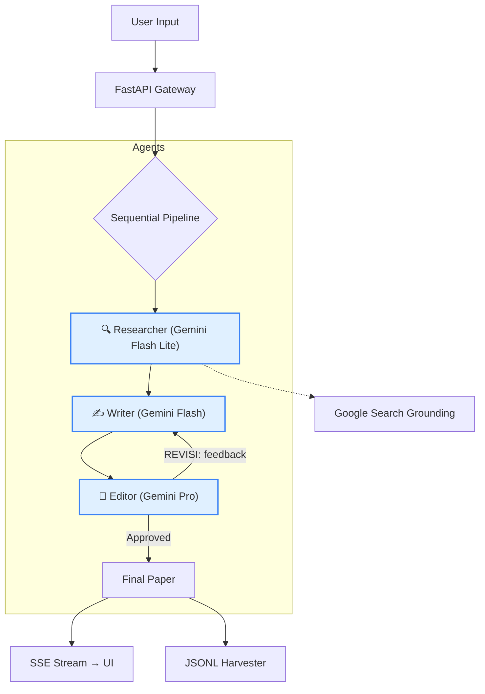

# 🦍 ai-researcher
### *Turn a research topic into a full academic draft in under 2 minutes.*

[](https://ai-researcher-app.web.app)
[](https://cloud.google.com/vertex-ai)
[](https://fastapi.tiangolo.com/)
[](https://reactjs.org/)
[](https://www.docker.com/)

> **Problem:** Writing a literature review takes 2–4 hours of searching, reading, and synthesizing.  
> **Solution:** ai-researcher does it in ~90 seconds — with real citations, not hallucinations.

---

## 🌐 Live Demo

| Service | URL |
| :--- | :--- |
| **Frontend App** | [ai-researcher-app.web.app](https://ai-researcher-app.web.app) |
| **Backend API** | [ai-researcher-backend-2kxz62u5na-uc.a.run.app](https://ai-researcher-backend-2kxz62u5na-uc.a.run.app) |
| **API Docs** | [.../docs](https://ai-researcher-backend-2kxz62u5na-uc.a.run.app/docs) |

---

## 🧲 What Makes This Different

Most "AI research tools" are just wrappers around a single LLM prompt. This isn't.

**ai-researcher runs a coordinated pipeline of three specialized AI agents:**

```
User Input
    └─► Researcher (Gemini Flash)   ← finds real sources via Google Search Grounding
            └─► Writer (Gemini Flash)    ← synthesizes into academic prose
                    └─► Editor (Gemini Pro)      ← reviews, requests revision if needed
                            └─► Final Paper  ← streamed live to the UI
```

Each agent has a single responsibility. The Editor can loop back to the Writer up to 2 times before approving — mimicking a real peer-review cycle.

---

## 💡 Core Features

| Feature | What it does |
| :--- | :--- |
| **🗞️ Sequential Multi-Agent** | 3 agents with distinct roles, orchestrated in series — not a single monolithic prompt |
| **📡 Real-time SSE Streaming** | Every agent logs its progress live to the UI as it happens |
| **🔑 BYOK (Bring Your Own Key)** | Plug in your Gemini API key in the UI, or use the Vertex AI system mode — no config change needed |
| **🔍 Google Search Grounding** | Researcher queries live internet data, citations are grounded in real sources |
| **🌾 Dataset Harvester** | Every research cycle is auto-saved as JSONL — a ready-made dataset for AI fine-tuning |
| **📊 LLM Observability** | Latency, token usage, and cost estimate logged per agent, per request |

---

## 🌾 The Dataset Angle (Unique Value)

Every time someone uses this tool, the full `topic → research → draft` cycle is saved to `backend/data/harvester/` as JSONL:

```json
{
  "topic": "Scrum in e-commerce development",
  "sources": [...],
  "final_report": "...",
  "observability": {
    "pipeline_metrics": {
      "researcher": { "latency_ms": 3100, "tokens_total": 820 },
      "editor":     { "revision_loops": 1, "total_tokens": 4200 }
    },
    "cost_estimate_usd": 0.000067
  }
}
```

> Each row = one high-quality training example for fine-tuning a domain-specific research AI.  
> This is a **self-harvesting data flywheel** — the more it's used, the richer the dataset.

---

## 🧠 Architecture



---

## 🛠️ Tech Stack

| Layer | Tech |
| :--- | :--- |
| **Backend** | Python 3.12, FastAPI, Pydantic V2, Google GenAI SDK |
| **Frontend** | React 19, Vite 7, Tailwind CSS 4 |
| **AI** | Gemini 2.5 Flash Lite / Flash / Pro (3-tier model strategy) |
| **Infrastructure** | Docker, Docker Compose, GCP Cloud Run, Firebase Hosting |

---

## ⚡ Quick Start

```bash
git clone https://github.com/AriHyuk/ai-researcher.git
cd ai-researcher
cp backend/.env.example backend/.env
cp frontend/.env.example frontend/.env.local
make up
```

Open `http://localhost:3000`. Docker & Make required.

**Makefile shortcuts:** `make up` · `make logs` · `make restart` · `make clean`

---

## 🛡️ Engineering Practices

- **SOLID & DRY** applied in agent orchestration layer
- **12-Factor App** methodology
- **LLM Observability** — latency + token + cost tracked per agent call
- **Conventional Commits** for version history
- **Dual-environment config** — `.env` for production, `.env.local` for local dev

---

## 📖 Documentation

- [User Guide](docs/USER_GUIDE.md) — how to get the most out of this tool
- [Changelog](docs/CHANGELOG.md)

---

*Built to demonstrate advanced AI orchestration on Google Cloud. Not just a wrapper — a system.*
