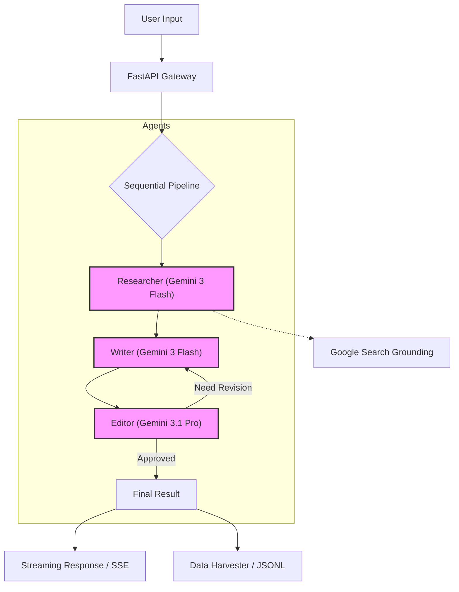

# 🦍 ai-researcher // Sequential Multi-Agent Research System

[](https://cloud.google.com/vertex-ai)
[](https://fastapi.tiangolo.com/)
[](https://reactjs.org/)
[](https://www.docker.com/)

Sistem riset otomatis berbasis AI yang mengadopsi arsitektur **Sequential Multi-Agent**. Project ini dirancang untuk menunjukkan kapabilitas orkestrasi model AI tingkat lanjut di **Google Cloud Vertex AI** dengan pendekatan modular monorepo.

## 🌐 Live Demo
- **Frontend:** [https://ai-researcher-app.web.app](https://ai-researcher-app.web.app)
- **Backend API:** [https://ai-researcher-backend-2kxz62u5na-uc.a.run.app](https://ai-researcher-backend-2kxz62u5na-uc.a.run.app)

---

## 💎 Mengapa Project Ini Berguna? (Functional Value)

Project ini bukan cuma buat "keren-kerenan" Docker atau AI. Secara fungsional, ini adalah solusi untuk **Research Bottleneck**:

1. **Automated Literature Review:** Mencari dan merangkum 4-10 sumber terpercaya dalam 15 detik. Manual? Bisa 2 jam.
2. **Dataset Engine (The JSONL Value):** File di `backend/data/harvester/` adalah aset paling berharga. Ini adalah data **High-Quality Synthetic Research**.
   - *Scenario:* Abang mau bikin AI yang jago riset gaya abang sendiri. Abang butuh ribuan contoh. Tool ini otomatis "memanen" contoh-contoh itu setiap kali abang riset.
3. **Cross-Check Validation:** Dengan Google Search Grounding, hasil tulisan bukan sekadar karangan AI (halusinasi), tapi ada referensinya.
4. **Academic Workflow Automation:** Menggantikan proses *Drafting -> Peer Review -> Revision* yang biasanya manual jadi otomatis lewat agen Editor.

> [!IMPORTANT]
> **Real World Value:** Perusahaan AI besar membayar mahal untuk data "Research-to-Draft" yang berkualitas. Tool ini membuat abang bisa memproduksi data tersebut secara mandiri.

---

## 🧠 System Architecture

Project ini menggunakan tiga agen terspesialisasi yang bekerja secara berurutan untuk menghasilkan riset berkualitas akademik.



---

## � Fitur Unggulan (Core Highlights)

| Fitur | Deskripsi | Tech |
| :--- | :--- | :--- |
| **🤖 Sequential Multi-Agent** | Alur kerja terstruktur: **Researcher** mencari data, **Writer** menyusun draf, **Editor** melakukan review & revisi otomatis. | Gemini Flash + Pro |
| **� BYOK (Bring Your Own Key)** | Mendukung penggunaan **Gemini API Key** (Public) atau **Vertex AI** (GCP Enterprise) lewat deteksi header dinamis. | Dual-Auth Strategy |
| **📡 Live Streaming SSE** | Pengalaman pengguna real-time dengan progres log transparan saat agen bekerja (Server-Sent Events). | FastAPI Streaming |
| **🏢 Data Harvester** | Fitur 'panen' data otomatis yang menyimpan setiap cycle riset ke dalam format `JSONL` untuk dataset fine-tuning AI. | JSONL Persistence |
| **�️ Google Grounding** | Menjamin hasil tulisan akurat dan valid berdasarkan data internet real-time (bukan sekadar karangan AI). | Search Grounding SDK |

---

## 🛠️ Tech Stack

- **Backend:** Python, FastAPI, Pydantic V2, Google GenAI SDK.
- **Frontend:** React, Vite, Tailwind CSS, React-Markdown.
- **Infrastructure:** Docker, Docker Compose, Google Cloud Vertex AI.

---

## ⚡ Quick Start

Pastikan Anda sudah menginstall **Docker** dan **Make**.


1. **Clone & Setup Env:**

   ```bash
   git clone https://github.com/AriHyuk/ai-researcher.git
   cd ai-researcher
   cp backend/.env.example backend/.env
   cp frontend/.env.example frontend/.env.local
   ```

2. **Run Everything:**

   ```bash
   make up
   ```

3. **Akses UI:**
   Buka `http://localhost:3000` di browser favorit Anda.

---

## 📜 Makefile Commands

Gunakan `make help` untuk melihat semua shortcut:

- `make up` - Jalankan semua container.
- `make logs` - Lihat log real-time.
- `make restart` - Restart semua layanan.
- `make clean` - Bersihkan system (volumes & images).

---

## 🛡️ Best Practices Applied

- **SOLID & DRY Principles** in AI Orchestration.
- **AWS Well-Architected Adaptation** for GCP Reliability.
- **Conventional Commits** for versioning excellence.
- **12-Factor App** methodology.

---

Created with ❤️ for Advanced AI Research Portfolio.
